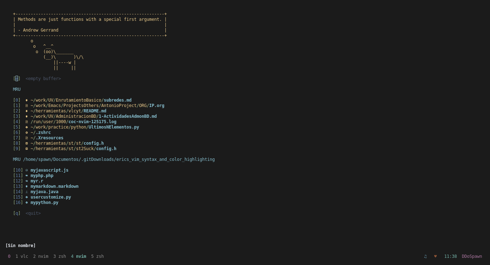
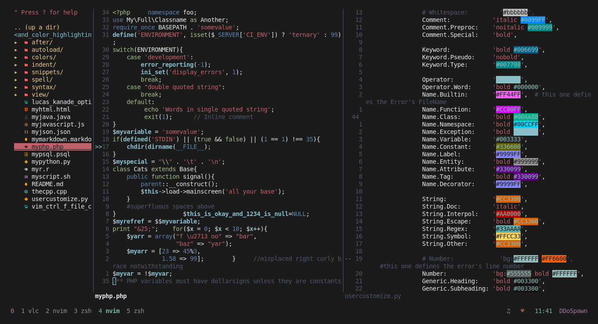
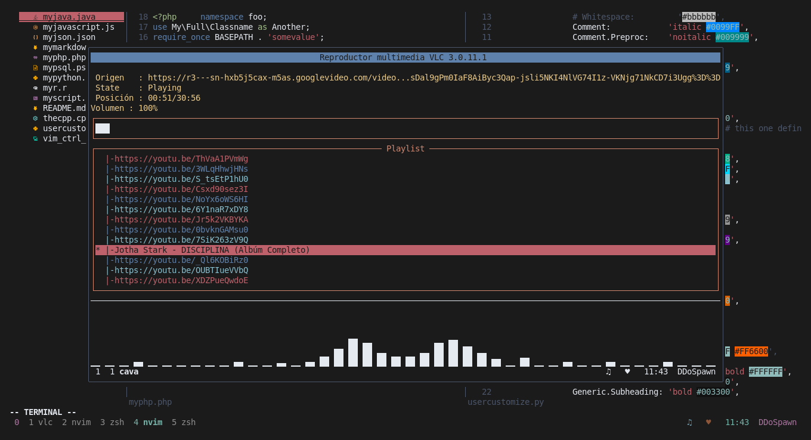
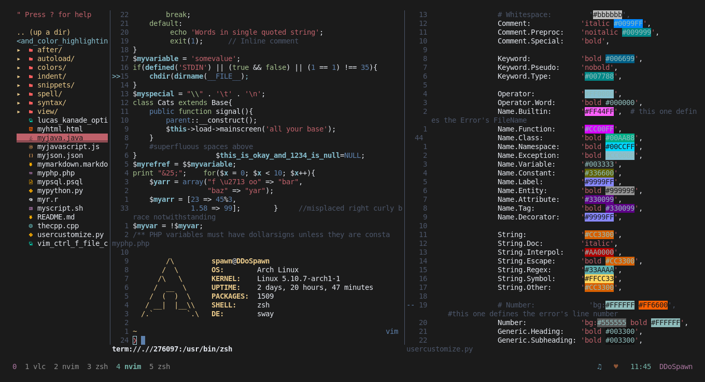
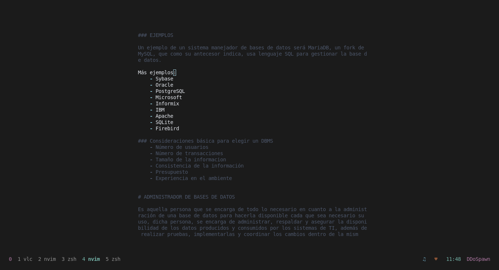

# My config of Neovim

| [STARTIFY](https://github.com/mhinz/vim-startify.git) |
| -- |
|  |

| [NERDTree](https://github.com/preservim/nerdtree.git) \| [COLORIZER](https://github.com/chrisbra/Colorizer.git) |
| -- |
| 

| [TMUX](https://github.com/tmux/tmux) \|  [VLC](https://github.com/videolan/vlc.git) \| [CAVA](https://github.com/karlstav/cava.git)|
| -- |
|  |

| [FLOATERM](https://github.com/voldikss/vim-floaterm) \| [UFETCH](https://gitlab.com/jschx/ufetch.git) |
| -- |
| 

| [GOYO](https://github.com/junegunn/goyo.vim.git) \| [LIMELIGHT](https://github.com/junegunn/limelight.vim.git) |
| -- |
| 

All plugins of my Neovim config: [Plugins](https://github.com/spawmc/Neovim-SFW/blob/main/env/plugins.vim)

## Installation

On `Arch Linux` you can use:
```bash
sudo pacman -Sy ripgrep fzf bat the_silver_searcher nodejs npm neovim
sh -c 'curl -fLo "${XDG_DATA_HOME:-$HOME/.local/share}"/nvim/site/autoload/plug.vim --create-dirs \
       https://raw.githubusercontent.com/junegunn/vim-plug/master/plug.vim'
```

On `Fedora Linux` you can use:
```bash
sudo dnf install -y ripgrep fzf bat the_silver_searcher nodejs npm neovim
sh -c 'curl -fLo "${XDG_DATA_HOME:-$HOME/.local/share}"/nvim/site/autoload/plug.vim --create-dirs \
       https://raw.githubusercontent.com/junegunn/vim-plug/master/plug.vim'
```

Later execute `nvim` and type:
```code
:PlugInstall
```

### Manual installation

You should install the following packages/dependencies:

- [neovim](https://neovim.io) (dah)
- Nodejs
- npm
- Ag
- Rg
- [fzf](https://github.com/junegunn/fzf)
- [bat](https://github.com/sharkdp/bat)

Then install [vim-plug](https://github.com/junegunn/vim-plug#Installation).

And open neovim and type:
```
:PlugInstall
```

I use Arch, BTW.

Thanks [@AlexisMtzGasca](https://github.com/AlexisMtzGasca) for the colors.